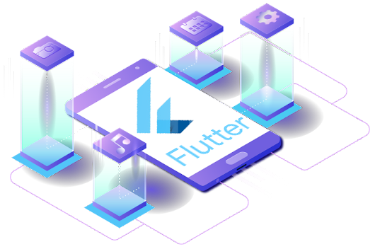

<h3 align="center">Je suis développeur de logiciels et apprenant passionné, toujours prêt à apprendre et à travailler sur plusieurs technologies. J'aime explorer les nouvelles technologies et essayer de résoudre des problèmes réels.</h3>

  

  

- 🔭 I’m currently working on **Geniusclass**

- 🌱 I’m currently learning **Nextjs,Reactjs,symfony,bootstrap,tailwindcss**

- 👯 I’m looking to collaborate on **Guibank's**

- 🤝 I’m looking for help with **Kambily**

- 📫 How to reach me **morykoulibaly2023@gmail.com**
   

  

 🧮 Visitors Count

  

 
⚡ Technologies

  
  <!--  -->

  
  

<!-- Most Used Languages -->

